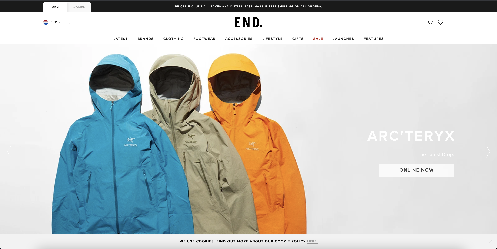
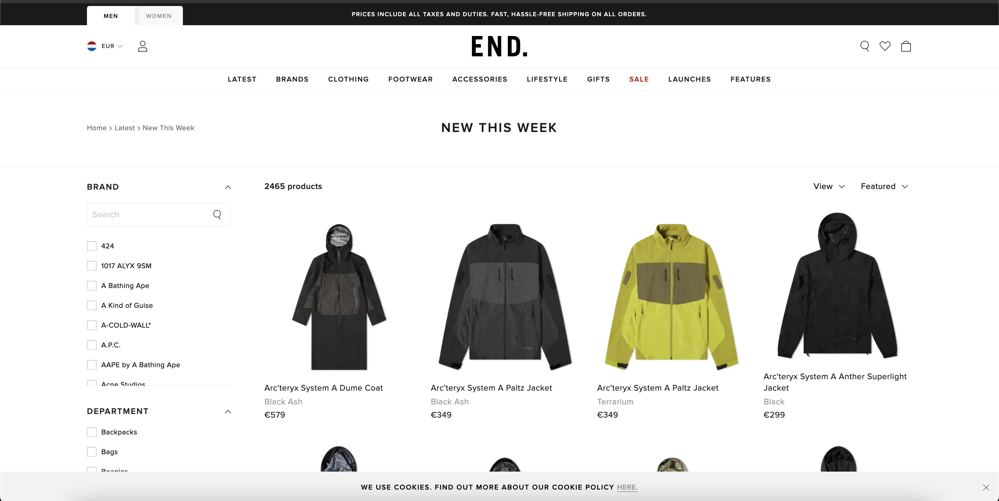
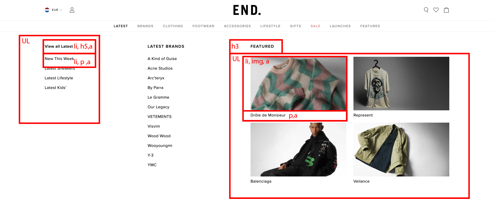

# Procesverslag
Markdown is een simpele manier om HTML te schrijven.  
Markdown cheat cheet: [Hulp bij het schrijven van Markdown](https://github.com/adam-p/markdown-here/wiki/Markdown-Cheatsheet).

Nb. De standaardstructuur en de spartaanse opmaak van de README.md zijn helemaal prima. Het gaat om de inhoud van je procesverslag. Besteedt de tijd voor pracht en praal aan je website.

Nb. Door *open* toe te voegen aan een *details* element kun je deze standaard open zetten. Fijn om dat steeds voor de relevante stuk(ken) te doen.

## Jij

uitwerken voor kick-off werkgroep

### Auteur:
Thije Wind

#### Je startniveau:
Blauw

#### Je focus:
Surface plane
 

## Je website

uitwerken voor kick-off werkgroep

### Je opdracht:
https://www.endclothing.com/nl

#### Screenshot(s) van de eerste pagina (small screen): 
Home page https://www.endclothing.com/nl 

#### Screenshot(s) van de tweede pagina (small screen):
https://www.endclothing.com/nl/latest-products/new-this-week

 

## Breakdownschets (week 1)

uitwerken na afloop 2e werkgroep

### de hele pagina: 

### dynamisch deel (bijv menu): 

### wellicht nog een dynamisch deel (bijv filter): 

## Voortgang 1 (week 2)

uitwerken voor 1e voortgang

### Stand van zaken
Ik heb deze weeek alleen nog wat html geschreven dus er was nog niet echt een mogelijkheid voor feedback.

### Agenda voor meeting
samen met je groepje opstellen

| student 1      | student 2          | student 3    | student 4        |
| ---            | ---                | ---          | ---              |
| dit bespreken  | en dit             | en ik dit    | en dan ik dat    |
| en dat ook nog | dit als er tijd is | nog een punt | dit wil ik zeker |
| ...            | ...                | ...          | ...              |

### Verslag van meeting

## Voortgang 2 (week 3)

uitwerken voor 2e voortgang

### Stand van zaken
Ik heb het hamburger menu gemaakt en de nav werkend gemaakt

### Agenda voor meeting
samen met je groepje opstellen

| Chelsey        | Maxime          | Bilal/Thije       | Fabian         |
Hamburger menu   | Slideshow maken  Voorgaande          imgs groter maken
maken                               onderwerpen         in verhouding 

### Verslag van meeting
hier na afloop snel de uitkomsten van de meeting vastleggen

Slideshow maken met behulp van de codepen van Sanne

## Toegankelijkheidstest (week 4)

### Bevindingen
Lijst met je bevindingen die in de test naar voren kwamen:

#### Titel bevindingen met toetsenbord
Wanneer je met tab door de pagina heen wilt navigeren gaat de tab ook langs alle onzichtbare mogelijkheden. Hierdoor geeft het het idee dat het niet werkt maar je moet gewoon heel vak op tab drukken. Hier moet ik een oplossing voor gaan vinden.

#### Titel screenreader bevindingen
Bij het oplezen van de headings worden sommigen headings dubbel uitgesproken. Ook gaat hij alle onzichtbare opties oplezen wat het voor de gebruiker erg verwarrend maakt. 

#### Titel volgende bevinding. 
Hier korte omschrijving (met indien nodig een afbeelding)

Hier een omschrijving van hoe het opgelost kan worden (met indien nodig een afbeelding)

#### Titel nog een bevinding. 
Hier korte omschrijving (met indien nodig een afbeelding)

Hier een omschrijving van hoe het opgelost kan worden (met indien nodig een afbeelding)

## Voortgang 3 (week 4)

uitwerken voor 3e voortgang

### Stand van zaken
De website is eigenlijk helemaal af en klaar  voor het eindgesprek

### Agenda voor meeting
samen met je groepje opstellen

| student 1      | student 2          | student 3    | student 4        |
| ---            | ---                | ---          | ---              |
| dit bespreken  | en dit             | en ik dit    | en dan ik dat    |
| en dat ook nog | dit als er tijd is | nog een punt | dit wil ik zeker |
| ...            | ...                | ...          | ...              |

### Verslag van meeting
Bij het gesprek was ik niet aanwezig.

## Eindgesprek (week 5)

uitwerken voor eindgesprek

### Stand van zaken
Het maken van de website ging eigenlijk erg goed. De opdrachten die in de les behandeld werden waren vaak van toepassing tijdens het maken van de site. Dit werkte erg goed omdat je dan eerst kennis op had gedaan uit de opdrachten en vervolgens meteen kon gebruiken in de praktijk. Wanneer ik echt vastliep en mijn vraag niet op internet kon vinden kon je altijd terecht bij 1 van de studentassistenten dit was echt top.

### Screenshot(s)

hier screenshot(s) van je eindresultaat

## Bronnenlijst

continu bijhouden terwijl je werkt

Nb. Wees specifiek ('css-tricks' als bron is bijv. niet specifiek genoeg).

1. https://codepen.io/thijew/pen/poroZjp (Footer dingetje door Sanne)
2. https://css-tricks.com/practical-css-scroll-snapping/ (Zorgt ervoor dat de nav niet meer scrollbaar is wanneer er een categorie geopend wordt in de nav)
3. De voorbeelden in de les van Sanne
4. https://css-tricks.com/snippets/css/a-guide-to-flexbox/ (Alle informatie over flexbox)
5. https://css-tricks.com/almanac/ (Alle css bergrippen opgezocht)

